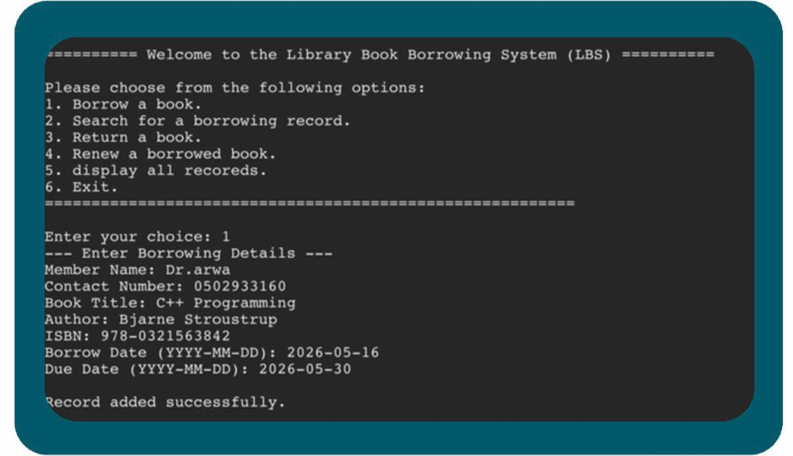

# Library Management System
## Overview

This project is a Library Book Borrowing System developed in C++ for the Data Structures course. It uses a Linked List to manage borrowing records and supports borrowing, searching, renewing, returning books, and displaying all records.

## Preview

